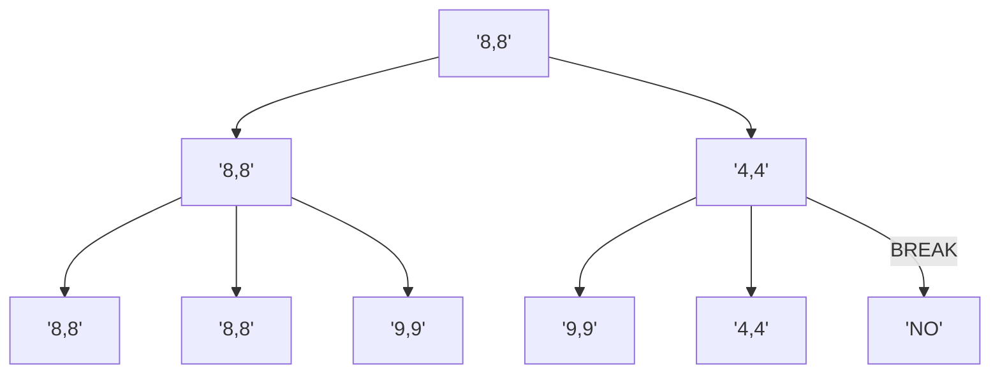

Minimax decision

```mermaid  
flowchart TD
	 A['8,8']--> B['8,8']
	 A --> C['4,4']
	 B-->D['8,8']
	 B-->E['8,8']
	 B-->F['9,9']
	 C-->G['9,9']
	 C-->H['4,4']
	 C--BREAK-->I['NO']
	 
```

this is all the thing i have i want you to understand that i  can be like you i can be love to 