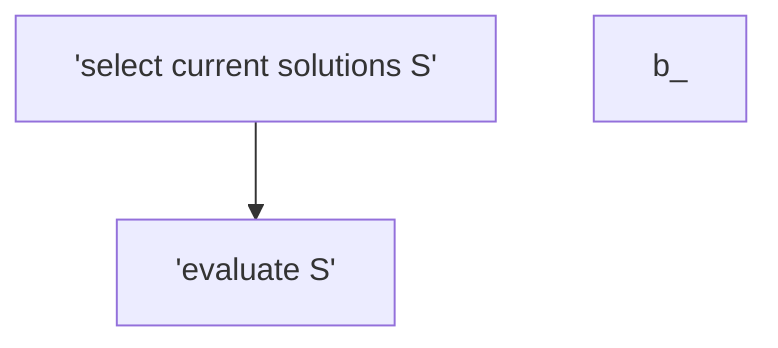

#sumarize  
Hill climbing Algorithm is a local search algorithm which is used to find the peak of a mountain or the best solution to a problem by continuosly moving in the direction of increasing elevation 
## example 
we select a point to start at then move up to get thought the higest point in the local area 
 

## hill climbing algorithm flowchart 

 