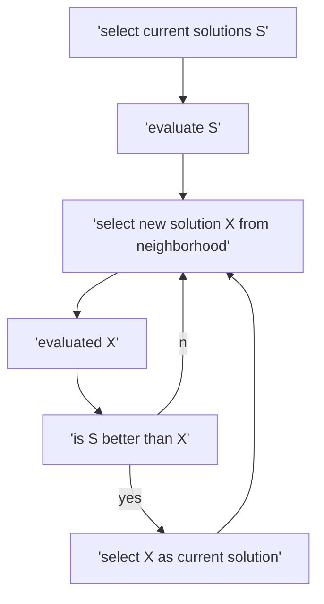

#sumarize  
Hill climbing Algorithm is a local search algorithm which is used to find the peak of a mountain or the best solution to a problem by continuosly moving in the direction of increasing elevation 
## example 
we select a point to start at then move up to get thought the higest point in the local area 
 

## hill climbing algorithm flowchart 

# fetures of hill climbing algorithm 
###  generate and test alternative 
hill climbign algorithm is a variation of gerate and test algorithm which generates alternative course of actions to see if they will slove the problem 
### greedy approach 
hill  climbing algorithm will always move in a direction which will give the best outcome .This is done to optimize the cost 
### no backtracking 
